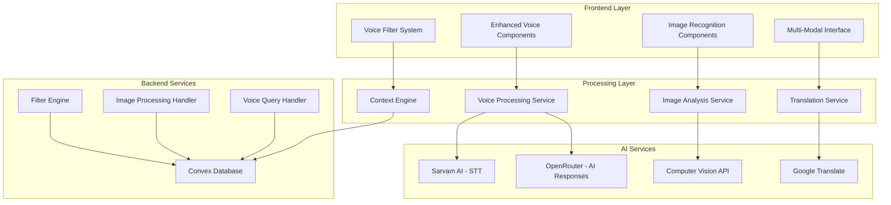
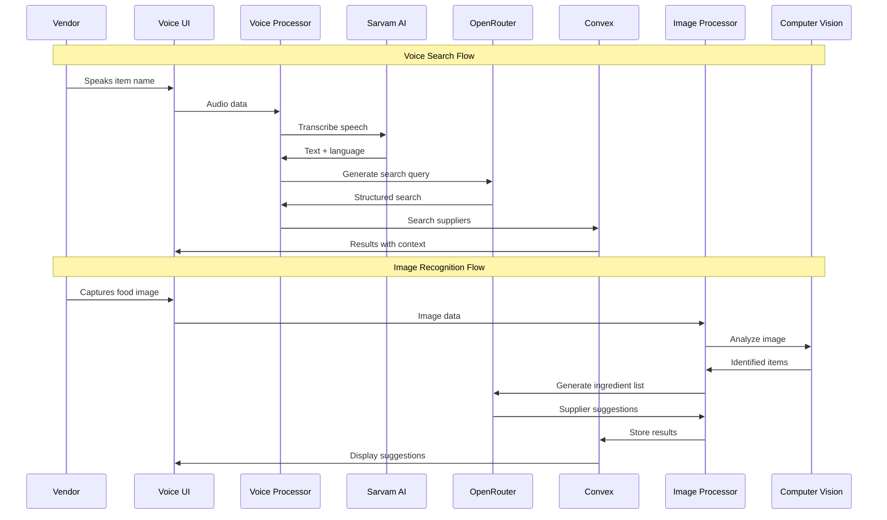

# Design Document

## Overview

The Enhanced Voice Features system extends the existing vendor sourcing platform with advanced multilingual voice capabilities and computer vision-based food item recognition. The system integrates Sarvam AI for multilingual speech-to-text, OpenRouter for intelligent AI responses, and computer vision models for food item identification. The architecture builds upon the existing React/TypeScript frontend and Convex backend while adding new components for voice-controlled search, image recognition, and intelligent filtering.

The system is designed to provide a seamless multi-modal experience where street food vendors can interact with the platform using voice commands in their native languages, capture images of food items for ingredient identification, and receive contextual responses based on their business data and preferences.

## Architecture

### High-Level Architecture



### Technology Stack Enhancement

- **Voice Processing**: Sarvam AI for multilingual STT, Web Audio API for recording
- **Image Recognition**: Computer Vision API (Clarifai/Google Vision), Canvas API for image processing
- **AI Integration**: OpenRouter with GPT-4o-mini for contextual responses
- **Translation**: Google Translate API for multilingual support
- **Audio Visualization**: Web Audio API with real-time frequency analysis
- **Offline Support**: IndexedDB for caching, Service Workers for offline functionality

### Data Flow Architecture



## Components and Interfaces

### Enhanced Voice Components

#### 1. Enhanced Voice Query Component
```typescript
interface EnhancedVoiceQueryProps {
  userRole: 'vendor' | 'supplier';
  mode: 'search' | 'filter' | 'general';
  onResults?: (results: SearchResults) => void;
  onFiltersApplied?: (filters: VoiceFilters) => void;
  className?: string;
}

interface VoiceSearchResults {
  items: SupplierItem[];
  suppliers: Supplier[];
  filters: AppliedFilters;
  confidence: number;
  originalQuery: string;
  translatedQuery: string;
  language: string;
}
```

#### 2. Voice Filter Controller
```typescript
interface VoiceFilterControllerProps {
  currentFilters: SearchFilters;
  onFiltersChanged: (filters: SearchFilters) => void;
  supportedLanguages: string[];
}

interface VoiceFilters {
  location?: string;
  priceRange?: { min: number; max: number };
  deliveryTime?: string;
  quality?: string;
  categories?: string[];
  fssaiRequired?: boolean;
}
```

#### 3. Multi-Modal Search Interface
```typescript
interface MultiModalSearchProps {
  onVoiceSearch: (query: string) => void;
  onImageSearch: (image: File) => void;
  onTextSearch: (query: string) => void;
  currentMode: 'voice' | 'image' | 'text';
  onModeChange: (mode: string) => void;
}
```

### Image Recognition Components

#### 1. Food Item Camera Component
```typescript
interface FoodItemCameraProps {
  onImageCaptured: (image: File) => void;
  onImageAnalyzed: (results: ImageAnalysisResults) => void;
  allowUpload?: boolean;
  maxImageSize?: number;
}

interface ImageAnalysisResults {
  identifiedItems: FoodItem[];
  ingredients: Ingredient[];
  confidence: number;
  suggestions: SupplierSuggestion[];
}
```

#### 2. Ingredient Recognition Display
```typescript
interface IngredientDisplayProps {
  ingredients: Ingredient[];
  suppliers: SupplierSuggestion[];
  onSupplierSelect: (supplier: Supplier) => void;
  onIngredientFilter: (ingredient: string) => void;
}

interface Ingredient {
  name: string;
  confidence: number;
  category: string;
  alternatives?: string[];
}
```

### Voice Processing Services

#### 1. Enhanced Voice Processor
```typescript
class EnhancedVoiceProcessor {
  private sarvamAPI: SarvamAPIClient;
  private openRouterAPI: OpenRouterClient;
  private translationService: TranslationService;
  
  async processVoiceSearch(
    audioData: Uint8Array,
    userContext: UserContext
  ): Promise<VoiceSearchResults>;
  
  async processVoiceFilter(
    audioData: Uint8Array,
    currentFilters: SearchFilters
  ): Promise<VoiceFilters>;
  
  async generateVoiceResponse(
    query: string,
    context: UserContext,
    language: string
  ): Promise<VoiceResponse>;
}
```

#### 2. Image Analysis Service
```typescript
class ImageAnalysisService {
  private visionAPI: ComputerVisionClient;
  private ingredientDB: IngredientDatabase;
  
  async analyzeImage(imageData: File): Promise<ImageAnalysisResults>;
  async identifyIngredients(items: FoodItem[]): Promise<Ingredient[]>;
  async suggestSuppliers(ingredients: Ingredient[]): Promise<SupplierSuggestion[]>;
}
```

### Data Models Enhancement

#### Voice Query Enhancement
```typescript
interface EnhancedVoiceQuery {
  id: string;
  userId: string;
  userRole: 'vendor' | 'supplier';
  queryType: 'search' | 'filter' | 'general' | 'image_description';
  originalAudio?: Uint8Array; // Temporarily stored for processing
  queryText: string;
  language: string;
  englishText: string;
  confidence: number;
  
  // Search-specific fields
  searchResults?: {
    items: string[];
    suppliers: string[];
    filters: VoiceFilters;
  };
  
  // Filter-specific fields
  appliedFilters?: VoiceFilters;
  
  // Image-related fields
  imageId?: string;
  identifiedItems?: string[];
  
  response: string;
  responseLanguage: string;
  processingTime: number;
  createdAt: number;
}
```

#### Image Analysis Records
```typescript
interface ImageAnalysisRecord {
  id: string;
  userId: string;
  imageUrl: string;
  imageHash: string; // For duplicate detection
  analysisResults: {
    identifiedItems: FoodItem[];
    ingredients: Ingredient[];
    confidence: number;
  };
  supplierSuggestions: SupplierSuggestion[];
  userFeedback?: {
    correctIdentification: boolean;
    actualItems?: string[];
    rating: number;
  };
  createdAt: number;
}
```

#### Voice Preferences
```typescript
interface VoicePreferences {
  userId: string;
  preferredLanguage: string;
  voiceSpeed: number; // For TTS
  autoTranslate: boolean;
  voiceShortcuts: {
    [key: string]: string; // Custom voice commands
  };
  filterPresets: {
    [name: string]: VoiceFilters;
  };
  privacySettings: {
    storeAudio: boolean;
    shareForImprovement: boolean;
  };
}
```

## Data Models

### Enhanced Database Schema

```typescript
// Enhanced Voice Queries table
voiceQueries: defineTable({
  userId: v.string(),
  userRole: v.string(),
  queryType: v.string(), // "search", "filter", "general", "image_description"
  queryText: v.string(),
  language: v.string(),
  englishText: v.string(),
  confidence: v.number(),
  
  // Search results
  searchResults: v.optional(v.object({
    items: v.array(v.string()),
    suppliers: v.array(v.string()),
    filters: v.object({
      location: v.optional(v.string()),
      priceRange: v.optional(v.object({
        min: v.number(),
        max: v.number()
      })),
      categories: v.optional(v.array(v.string())),
      deliveryTime: v.optional(v.string()),
      quality: v.optional(v.string()),
      fssaiRequired: v.optional(v.boolean())
    })
  })),
  
  // Applied filters
  appliedFilters: v.optional(v.object({
    location: v.optional(v.string()),
    priceRange: v.optional(v.object({
      min: v.number(),
      max: v.number()
    })),
    categories: v.optional(v.array(v.string())),
    deliveryTime: v.optional(v.string()),
    quality: v.optional(v.string()),
    fssaiRequired: v.optional(v.boolean())
  })),
  
  // Image analysis
  imageId: v.optional(v.string()),
  identifiedItems: v.optional(v.array(v.string())),
  
  response: v.string(),
  responseLanguage: v.string(),
  processingTime: v.number(),
  createdAt: v.number()
})

// Image Analysis table
imageAnalysis: defineTable({
  userId: v.string(),
  imageUrl: v.string(),
  imageHash: v.string(),
  analysisResults: v.object({
    identifiedItems: v.array(v.object({
      name: v.string(),
      confidence: v.number(),
      category: v.string(),
      alternatives: v.optional(v.array(v.string()))
    })),
    ingredients: v.array(v.object({
      name: v.string(),
      confidence: v.number(),
      category: v.string(),
      alternatives: v.optional(v.array(v.string()))
    })),
    overallConfidence: v.number()
  }),
  supplierSuggestions: v.array(v.object({
    supplierId: v.id("suppliers"),
    relevantIngredients: v.array(v.string()),
    matchScore: v.number(),
    priceEstimate: v.optional(v.number())
  })),
  userFeedback: v.optional(v.object({
    correctIdentification: v.boolean(),
    actualItems: v.optional(v.array(v.string())),
    rating: v.number(),
    comments: v.optional(v.string())
  })),
  createdAt: v.number()
})

// Voice Preferences table
voicePreferences: defineTable({
  userId: v.string(),
  preferredLanguage: v.string(),
  voiceSpeed: v.number(),
  autoTranslate: v.boolean(),
  voiceShortcuts: v.object({}), // Dynamic key-value pairs
  filterPresets: v.object({}), // Named filter configurations
  privacySettings: v.object({
    storeAudio: v.boolean(),
    shareForImprovement: v.boolean(),
    retentionDays: v.number()
  }),
  createdAt: v.number(),
  updatedAt: v.number()
})

// Voice Learning Data table (for improving recognition)
voiceLearningData: defineTable({
  userId: v.string(),
  language: v.string(),
  commonPhrases: v.array(v.object({
    phrase: v.string(),
    frequency: v.number(),
    context: v.string(),
    lastUsed: v.number()
  })),
  vocabularyPreferences: v.array(v.object({
    term: v.string(),
    preferredTranslation: v.string(),
    category: v.string()
  })),
  correctionHistory: v.array(v.object({
    original: v.string(),
    corrected: v.string(),
    timestamp: v.number()
  })),
  updatedAt: v.number()
})
```

### API Integration Interfaces

#### Sarvam AI Integration
```typescript
interface SarvamSTTRequest {
  audio: Blob;
  language?: string;
  model?: string;
}

interface SarvamSTTResponse {
  transcript: string;
  language: string;
  confidence: number;
  alternatives?: Array<{
    transcript: string;
    confidence: number;
  }>;
}
```

#### Computer Vision Integration
```typescript
interface VisionAPIRequest {
  image: string; // Base64 encoded
  features: string[];
  maxResults?: number;
}

interface VisionAPIResponse {
  objects: Array<{
    name: string;
    confidence: number;
    boundingBox?: BoundingBox;
  }>;
  text?: string;
  labels: Array<{
    description: string;
    score: number;
  }>;
}
```

#### OpenRouter Enhanced Integration
```typescript
interface OpenRouterRequest {
  model: string;
  messages: Array<{
    role: 'system' | 'user' | 'assistant';
    content: string;
  }>;
  functions?: Array<{
    name: string;
    description: string;
    parameters: object;
  }>;
  temperature?: number;
  max_tokens?: number;
}

interface OpenRouterResponse {
  choices: Array<{
    message: {
      content: string;
      function_call?: {
        name: string;
        arguments: string;
      };
    };
  }>;
  usage: {
    prompt_tokens: number;
    completion_tokens: number;
    total_tokens: number;
  };
}
```

## Error Handling

### Voice Processing Error Handling

#### 1. Audio Recording Errors
```typescript
interface AudioError {
  type: 'AUDIO_ERROR';
  code: 'PERMISSION_DENIED' | 'DEVICE_NOT_FOUND' | 'RECORDING_FAILED';
  message: string;
  recovery: string[];
}

const handleAudioError = (error: AudioError) => {
  switch (error.code) {
    case 'PERMISSION_DENIED':
      showPermissionDialog();
      break;
    case 'DEVICE_NOT_FOUND':
      suggestAlternativeInput();
      break;
    case 'RECORDING_FAILED':
      retryRecording();
      break;
  }
};
```

#### 2. Speech Recognition Errors
```typescript
interface SpeechError {
  type: 'SPEECH_ERROR';
  code: 'NO_SPEECH' | 'LOW_CONFIDENCE' | 'LANGUAGE_NOT_SUPPORTED';
  confidence?: number;
  alternatives?: string[];
}

const handleSpeechError = (error: SpeechError) => {
  if (error.code === 'LOW_CONFIDENCE' && error.alternatives) {
    showConfirmationDialog(error.alternatives);
  } else if (error.code === 'NO_SPEECH') {
    promptForRetry();
  }
};
```

#### 3. Image Processing Errors
```typescript
interface ImageError {
  type: 'IMAGE_ERROR';
  code: 'INVALID_FORMAT' | 'TOO_LARGE' | 'ANALYSIS_FAILED' | 'NO_FOOD_DETECTED';
  maxSize?: number;
  supportedFormats?: string[];
}

const handleImageError = (error: ImageError) => {
  switch (error.code) {
    case 'TOO_LARGE':
      compressAndRetry(error.maxSize);
      break;
    case 'NO_FOOD_DETECTED':
      suggestBetterImage();
      break;
    case 'INVALID_FORMAT':
      showFormatRequirements(error.supportedFormats);
      break;
  }
};
```

### Offline Error Handling

```typescript
class OfflineVoiceHandler {
  private cachedQueries: Map<string, VoiceQuery> = new Map();
  private offlineQueue: VoiceQuery[] = [];
  
  async handleOfflineVoice(query: VoiceQuery): Promise<VoiceResponse> {
    // Check cache for similar queries
    const cached = this.findSimilarQuery(query.queryText);
    if (cached) {
      return cached.response;
    }
    
    // Queue for online processing
    this.offlineQueue.push(query);
    
    // Return basic offline response
    return {
      answer: "Your query has been saved and will be processed when connection is restored.",
      isOffline: true,
      queuePosition: this.offlineQueue.length
    };
  }
  
  async syncOfflineQueries(): Promise<void> {
    while (this.offlineQueue.length > 0) {
      const query = this.offlineQueue.shift();
      if (query) {
        await this.processOnlineQuery(query);
      }
    }
  }
}
```

## Testing Strategy

### Voice Feature Testing

#### 1. Audio Processing Tests
```typescript
describe('Voice Processing', () => {
  it('should handle multiple languages correctly', async () => {
    const testCases = [
      { audio: hindiAudioSample, expected: 'टमाटर' },
      { audio: tamilAudioSample, expected: 'தக்காளி' },
      { audio: englishAudioSample, expected: 'tomato' }
    ];
    
    for (const testCase of testCases) {
      const result = await voiceProcessor.process(testCase.audio);
      expect(result.queryText).toContain(testCase.expected);
    }
  });
  
  it('should handle low quality audio gracefully', async () => {
    const noisyAudio = addNoise(cleanAudioSample, 0.3);
    const result = await voiceProcessor.process(noisyAudio);
    
    expect(result.confidence).toBeLessThan(0.8);
    expect(result.alternatives).toBeDefined();
  });
});
```

#### 2. Image Recognition Tests
```typescript
describe('Image Recognition', () => {
  it('should identify common food items', async () => {
    const testImages = [
      { image: tomatoImage, expected: ['tomato', 'vegetable'] },
      { image: onionImage, expected: ['onion', 'vegetable'] },
      { image: riceImage, expected: ['rice', 'grain'] }
    ];
    
    for (const testCase of testImages) {
      const result = await imageAnalyzer.analyze(testCase.image);
      expect(result.identifiedItems.map(i => i.name))
        .toEqual(expect.arrayContaining(testCase.expected));
    }
  });
});
```

#### 3. Multi-Modal Integration Tests
```typescript
describe('Multi-Modal Integration', () => {
  it('should combine voice and image inputs effectively', async () => {
    // Voice: "I need ingredients for samosa"
    const voiceQuery = await processVoice(samosaVoiceQuery);
    
    // Image: Picture of samosa
    const imageAnalysis = await analyzeImage(samosaImage);
    
    // Combined results should include potato, onion, flour, etc.
    const combinedResults = await combineInputs(voiceQuery, imageAnalysis);
    
    expect(combinedResults.ingredients).toContain('potato');
    expect(combinedResults.ingredients).toContain('flour');
    expect(combinedResults.suppliers).toBeDefined();
  });
});
```

### Performance Testing

#### 1. Voice Processing Performance
```typescript
describe('Performance Tests', () => {
  it('should process voice queries within 5 seconds', async () => {
    const startTime = Date.now();
    const result = await voiceProcessor.process(testAudio);
    const endTime = Date.now();
    
    expect(endTime - startTime).toBeLessThan(5000);
    expect(result).toBeDefined();
  });
  
  it('should handle concurrent voice requests', async () => {
    const promises = Array(10).fill(null).map(() => 
      voiceProcessor.process(testAudio)
    );
    
    const results = await Promise.all(promises);
    expect(results).toHaveLength(10);
    results.forEach(result => expect(result).toBeDefined());
  });
});
```

#### 2. Image Processing Performance
```typescript
describe('Image Performance', () => {
  it('should process images within 10 seconds', async () => {
    const startTime = Date.now();
    const result = await imageAnalyzer.analyze(testImage);
    const endTime = Date.now();
    
    expect(endTime - startTime).toBeLessThan(10000);
    expect(result.identifiedItems).toBeDefined();
  });
});
```

### Accessibility Testing

```typescript
describe('Accessibility', () => {
  it('should provide keyboard navigation for voice controls', () => {
    render(<EnhancedVoiceQuery />);
    
    const voiceButton = screen.getByRole('button', { name: /start recording/i });
    expect(voiceButton).toBeInTheDocument();
    
    fireEvent.keyDown(voiceButton, { key: 'Enter' });
    expect(screen.getByText(/recording/i)).toBeInTheDocument();
  });
  
  it('should provide screen reader support', () => {
    render(<EnhancedVoiceQuery />);
    
    const status = screen.getByRole('status');
    expect(status).toHaveAttribute('aria-live', 'polite');
  });
});
```

This comprehensive design document provides the foundation for implementing enhanced voice and image recognition features that will significantly improve the user experience for street food vendors while maintaining the existing platform's reliability and performance standards.