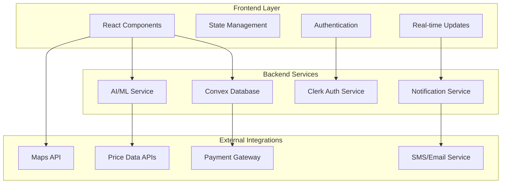
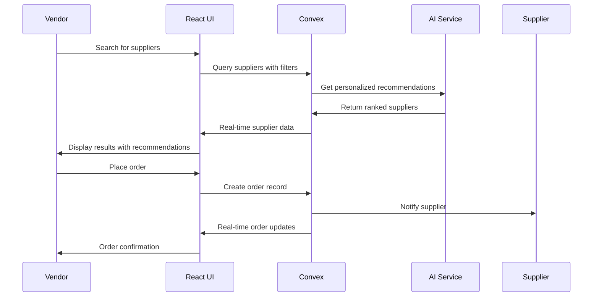
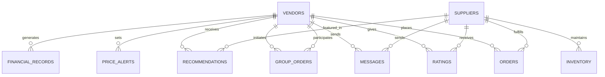

# Design Document

## Overview

The Vendor Sourcing Platform is a comprehensive web application built using React, TypeScript, and Convex as the backend-as-a-service. The platform leverages Clerk for authentication and implements a modern, responsive design using Tailwind CSS. The architecture follows a component-based approach with real-time data synchronization, AI-powered recommendations, and mobile-first responsive design.

The system is designed to handle the complex workflows of street food vendor sourcing while maintaining simplicity and performance. It integrates multiple subsystems including user management, supplier discovery, AI recommendations, group ordering, real-time inventory tracking, and financial analytics.

## Architecture

### High-Level Architecture



### Technology Stack

- **Frontend**: React 19.1.0 with TypeScript
- **Styling**: Tailwind CSS with responsive design
- **Backend**: Convex (real-time database and functions)
- **Authentication**: Clerk React
- **Build Tool**: Vite
- **State Management**: React hooks with Convex real-time queries
- **Mobile Support**: Progressive Web App (PWA) capabilities

### Data Flow Architecture



## Components and Interfaces

### Core Components

#### 1. Authentication System
- **VendorAuth Component**: Handles vendor registration and login
- **ProfileManagement Component**: Manages vendor profile updates
- **TrustScoreDisplay Component**: Shows vendor trust metrics

#### 2. Supplier Discovery System
- **SupplierSearch Component**: Advanced search with filters
- **SupplierCard Component**: Displays supplier information
- **SupplierDetails Component**: Detailed supplier view
- **LocationFilter Component**: Geographic filtering

#### 3. AI Recommendation Engine
- **RecommendationPanel Component**: Displays AI suggestions
- **PreferenceSettings Component**: Manages recommendation preferences
- **FeedbackCapture Component**: Collects user feedback for ML

#### 4. Group Ordering System
- **GroupOrderList Component**: Shows available group orders
- **GroupOrderCreation Component**: Creates new group orders
- **GroupOrderParticipation Component**: Join existing orders
- **GroupOrderProgress Component**: Tracks order progress

#### 5. Inventory and Pricing System
- **InventoryTracker Component**: Real-time stock levels
- **PriceAlerts Component**: Price change notifications
- **PriceHistory Component**: Historical price charts
- **MarketInsights Component**: Market trend analysis

#### 6. Order Management System
- **OrderPlacement Component**: Order creation interface
- **OrderTracking Component**: Real-time order status
- **OrderHistory Component**: Past order records
- **OrderDetails Component**: Detailed order view

#### 7. Trust and Rating System
- **RatingInterface Component**: Submit ratings and reviews
- **TrustScoreCalculator Component**: Trust score computation
- **ReviewDisplay Component**: Show supplier reviews
- **ReputationDashboard Component**: Vendor reputation metrics

#### 8. Financial Management System
- **ExpenseTracker Component**: Track sourcing costs
- **FinancialAnalytics Component**: Spending analysis
- **BudgetManager Component**: Budget setting and alerts
- **CostOptimization Component**: Cost-saving recommendations

#### 9. Communication System
- **MessagingInterface Component**: Vendor-supplier chat
- **NotificationCenter Component**: System notifications
- **SupportChat Component**: Customer support
- **DisputeResolution Component**: Handle conflicts

#### 10. Mobile and Offline System
- **OfflineManager Component**: Handle offline functionality
- **DataSync Component**: Synchronize offline actions
- **MobileNavigation Component**: Mobile-optimized navigation
- **PWAInstaller Component**: Progressive web app installation

### Interface Definitions

#### Core Data Interfaces

```typescript
interface Vendor {
  id: string;
  userId: string; // Clerk user ID
  businessName: string;
  ownerName: string;
  email: string;
  phone: string;
  location: GeoLocation;
  businessType: string;
  fssaiLicense?: string;
  isVerified: boolean;
  trustScore: number;
  preferences: VendorPreferences;
  createdAt: number;
  updatedAt: number;
}

interface Supplier {
  id: string;
  userId: string;
  businessName: string;
  ownerName: string;
  email: string;
  phone: string;
  location: GeoLocation;
  categories: string[];
  inventory: InventoryItem[];
  fssaiCertified: boolean;
  fssaiLicense?: string;
  isVerified: boolean;
  trustScore: number;
  ratings: Rating[];
  createdAt: number;
  updatedAt: number;
}

interface Order {
  id: string;
  vendorId: string;
  supplierId: string;
  items: OrderItem[];
  totalCost: number;
  status: OrderStatus;
  orderType: 'individual' | 'group';
  groupOrderId?: string;
  deliveryAddress: string;
  estimatedDelivery: number;
  actualDelivery?: number;
  paymentStatus: PaymentStatus;
  createdAt: number;
  updatedAt: number;
}

interface GroupOrder {
  id: string;
  initiatorId: string;
  itemName: string;
  targetQuantity: number;
  currentQuantity: number;
  pricePerUnit: number;
  participants: GroupParticipant[];
  supplierId: string;
  status: GroupOrderStatus;
  expiresAt: number;
  createdAt: number;
}

interface AIRecommendation {
  id: string;
  vendorId: string;
  supplierId: string;
  score: number;
  reasons: string[];
  itemCategories: string[];
  priceAdvantage?: number;
  trustFactor: number;
  locationScore: number;
  createdAt: number;
}
```

#### API Interface Patterns

```typescript
// Convex query/mutation patterns
interface ConvexQueries {
  getSuppliers: (filters: SupplierFilters) => Promise<Supplier[]>;
  getRecommendations: (vendorId: string) => Promise<AIRecommendation[]>;
  getGroupOrders: (location: string) => Promise<GroupOrder[]>;
  getOrderHistory: (vendorId: string) => Promise<Order[]>;
  getInventoryUpdates: (supplierIds: string[]) => Promise<InventoryUpdate[]>;
}

interface ConvexMutations {
  createOrder: (orderData: CreateOrderRequest) => Promise<Order>;
  joinGroupOrder: (groupOrderId: string, quantity: number) => Promise<void>;
  submitRating: (rating: RatingSubmission) => Promise<void>;
  updatePreferences: (preferences: VendorPreferences) => Promise<void>;
  sendMessage: (message: MessageData) => Promise<void>;
}
```

## Data Models

### Database Schema Design

The Convex database schema is designed for real-time performance and scalability:

#### Enhanced Schema Tables

```typescript
// Vendors table (enhanced)
vendors: defineTable({
  userId: v.string(),
  businessName: v.string(),
  ownerName: v.string(),
  email: v.string(),
  phone: v.string(),
  location: v.object({
    address: v.string(),
    city: v.string(),
    state: v.string(),
    pincode: v.string(),
    coordinates: v.object({
      lat: v.number(),
      lng: v.number()
    })
  }),
  businessType: v.string(),
  fssaiLicense: v.optional(v.string()),
  isVerified: v.boolean(),
  trustScore: v.number(),
  preferences: v.object({
    maxDeliveryDistance: v.number(),
    preferredCategories: v.array(v.string()),
    budgetRange: v.object({
      min: v.number(),
      max: v.number()
    }),
    qualityPreference: v.string(),
    deliveryTimePreference: v.string()
  }),
  createdAt: v.number(),
  updatedAt: v.number()
})

// Suppliers table (enhanced)
suppliers: defineTable({
  userId: v.string(),
  businessName: v.string(),
  ownerName: v.string(),
  email: v.string(),
  phone: v.string(),
  location: v.object({
    address: v.string(),
    city: v.string(),
    state: v.string(),
    pincode: v.string(),
    coordinates: v.object({
      lat: v.number(),
      lng: v.number()
    })
  }),
  categories: v.array(v.string()),
  fssaiCertified: v.boolean(),
  fssaiLicense: v.optional(v.string()),
  isVerified: v.boolean(),
  trustScore: v.number(),
  businessHours: v.object({
    open: v.string(),
    close: v.string(),
    days: v.array(v.string())
  }),
  deliveryRadius: v.number(),
  minimumOrder: v.number(),
  createdAt: v.number(),
  updatedAt: v.number()
})

// Inventory table
inventory: defineTable({
  supplierId: v.id("suppliers"),
  itemName: v.string(),
  category: v.string(),
  currentStock: v.number(),
  unit: v.string(),
  pricePerUnit: v.number(),
  minimumOrder: v.number(),
  quality: v.string(),
  expiryDate: v.optional(v.number()),
  lastUpdated: v.number(),
  isAvailable: v.boolean()
})

// Orders table (enhanced)
orders: defineTable({
  vendorId: v.id("vendors"),
  supplierId: v.id("suppliers"),
  items: v.array(v.object({
    itemName: v.string(),
    quantity: v.number(),
    unit: v.string(),
    pricePerUnit: v.number(),
    totalPrice: v.number()
  })),
  totalCost: v.number(),
  status: v.string(),
  orderType: v.string(),
  groupOrderId: v.optional(v.id("groupOrders")),
  deliveryAddress: v.string(),
  estimatedDelivery: v.number(),
  actualDelivery: v.optional(v.number()),
  paymentStatus: v.string(),
  paymentMethod: v.string(),
  notes: v.optional(v.string()),
  createdAt: v.number(),
  updatedAt: v.number()
})

// Group Orders table
groupOrders: defineTable({
  initiatorId: v.id("vendors"),
  itemName: v.string(),
  category: v.string(),
  targetQuantity: v.number(),
  currentQuantity: v.number(),
  pricePerUnit: v.number(),
  participants: v.array(v.object({
    vendorId: v.id("vendors"),
    quantity: v.number(),
    joinedAt: v.number()
  })),
  supplierId: v.id("suppliers"),
  status: v.string(),
  location: v.string(),
  expiresAt: v.number(),
  createdAt: v.number()
})

// Ratings table
ratings: defineTable({
  vendorId: v.id("vendors"),
  supplierId: v.id("suppliers"),
  orderId: v.id("orders"),
  rating: v.number(),
  review: v.optional(v.string()),
  categories: v.object({
    quality: v.number(),
    delivery: v.number(),
    communication: v.number(),
    pricing: v.number()
  }),
  createdAt: v.number()
})

// Messages table
messages: defineTable({
  senderId: v.string(),
  receiverId: v.string(),
  senderType: v.string(),
  receiverType: v.string(),
  content: v.string(),
  messageType: v.string(),
  orderId: v.optional(v.id("orders")),
  isRead: v.boolean(),
  createdAt: v.number()
})

// AI Recommendations table
recommendations: defineTable({
  vendorId: v.id("vendors"),
  supplierId: v.id("suppliers"),
  score: v.number(),
  reasons: v.array(v.string()),
  itemCategories: v.array(v.string()),
  priceAdvantage: v.optional(v.number()),
  trustFactor: v.number(),
  locationScore: v.number(),
  isActive: v.boolean(),
  createdAt: v.number(),
  expiresAt: v.number()
})

// Price Alerts table
priceAlerts: defineTable({
  vendorId: v.id("vendors"),
  itemName: v.string(),
  targetPrice: v.number(),
  currentPrice: v.number(),
  supplierId: v.optional(v.id("suppliers")),
  isActive: v.boolean(),
  lastTriggered: v.optional(v.number()),
  createdAt: v.number()
})

// Financial Analytics table
financialRecords: defineTable({
  vendorId: v.id("vendors"),
  orderId: v.id("orders"),
  amount: v.number(),
  category: v.string(),
  itemName: v.string(),
  supplierId: v.id("suppliers"),
  date: v.number(),
  month: v.string(),
  year: v.number()
})
```

### Data Relationships



## Error Handling

### Error Categories and Handling Strategy

#### 1. Authentication Errors
```typescript
interface AuthError {
  type: 'AUTH_ERROR';
  code: 'INVALID_CREDENTIALS' | 'SESSION_EXPIRED' | 'UNAUTHORIZED';
  message: string;
  redirectTo?: string;
}

// Handling strategy
const handleAuthError = (error: AuthError) => {
  switch (error.code) {
    case 'SESSION_EXPIRED':
      // Redirect to login with return URL
      window.location.href = `/login?returnTo=${window.location.pathname}`;
      break;
    case 'UNAUTHORIZED':
      // Show permission denied message
      showNotification('Access denied. Please contact support.', 'error');
      break;
  }
};
```

#### 2. Network and API Errors
```typescript
interface NetworkError {
  type: 'NETWORK_ERROR';
  code: 'CONNECTION_FAILED' | 'TIMEOUT' | 'SERVER_ERROR';
  message: string;
  retryable: boolean;
}

// Retry mechanism with exponential backoff
const retryWithBackoff = async (fn: Function, maxRetries = 3) => {
  for (let i = 0; i < maxRetries; i++) {
    try {
      return await fn();
    } catch (error) {
      if (i === maxRetries - 1) throw error;
      await new Promise(resolve => setTimeout(resolve, Math.pow(2, i) * 1000));
    }
  }
};
```

#### 3. Validation Errors
```typescript
interface ValidationError {
  type: 'VALIDATION_ERROR';
  field: string;
  message: string;
  value: any;
}

// Form validation with real-time feedback
const validateOrderForm = (orderData: OrderFormData): ValidationError[] => {
  const errors: ValidationError[] = [];
  
  if (!orderData.quantity || orderData.quantity <= 0) {
    errors.push({
      type: 'VALIDATION_ERROR',
      field: 'quantity',
      message: 'Quantity must be greater than 0',
      value: orderData.quantity
    });
  }
  
  return errors;
};
```

#### 4. Business Logic Errors
```typescript
interface BusinessError {
  type: 'BUSINESS_ERROR';
  code: 'INSUFFICIENT_STOCK' | 'ORDER_EXPIRED' | 'PAYMENT_FAILED';
  message: string;
  suggestions?: string[];
}

// Business error handling with user guidance
const handleBusinessError = (error: BusinessError) => {
  switch (error.code) {
    case 'INSUFFICIENT_STOCK':
      showNotification(error.message, 'warning');
      suggestAlternativeSuppliers();
      break;
    case 'ORDER_EXPIRED':
      showNotification('Order has expired. Please create a new order.', 'info');
      redirectToOrderCreation();
      break;
  }
};
```

### Global Error Boundary

```typescript
class ErrorBoundary extends React.Component {
  state = { hasError: false, error: null };
  
  static getDerivedStateFromError(error: Error) {
    return { hasError: true, error };
  }
  
  componentDidCatch(error: Error, errorInfo: React.ErrorInfo) {
    // Log error to monitoring service
    console.error('Application error:', error, errorInfo);
    
    // Send error report
    sendErrorReport({
      error: error.message,
      stack: error.stack,
      componentStack: errorInfo.componentStack,
      timestamp: Date.now()
    });
  }
  
  render() {
    if (this.state.hasError) {
      return <ErrorFallback error={this.state.error} />;
    }
    
    return this.props.children;
  }
}
```

## Testing Strategy

### Testing Pyramid Approach

#### 1. Unit Testing (70%)
- **Component Testing**: Test individual React components in isolation
- **Utility Function Testing**: Test helper functions and business logic
- **Hook Testing**: Test custom React hooks
- **Validation Testing**: Test form validation and data validation

```typescript
// Example component test
describe('SupplierCard Component', () => {
  it('should display supplier information correctly', () => {
    const mockSupplier = {
      id: '1',
      businessName: 'Fresh Vegetables Co',
      trustScore: 4.5,
      location: 'Mumbai'
    };
    
    render(<SupplierCard supplier={mockSupplier} />);
    
    expect(screen.getByText('Fresh Vegetables Co')).toBeInTheDocument();
    expect(screen.getByText('4.5')).toBeInTheDocument();
    expect(screen.getByText('Mumbai')).toBeInTheDocument();
  });
});
```

#### 2. Integration Testing (20%)
- **API Integration**: Test Convex queries and mutations
- **Authentication Flow**: Test Clerk integration
- **Real-time Updates**: Test Convex subscriptions
- **Component Integration**: Test component interactions

```typescript
// Example integration test
describe('Order Placement Flow', () => {
  it('should create order and update inventory', async () => {
    const orderData = {
      vendorId: 'vendor1',
      supplierId: 'supplier1',
      items: [{ itemName: 'Tomatoes', quantity: 10 }]
    };
    
    const order = await createOrder(orderData);
    expect(order).toBeDefined();
    
    const updatedInventory = await getInventory('supplier1');
    expect(updatedInventory.find(item => item.itemName === 'Tomatoes').currentStock)
      .toBeLessThan(originalStock);
  });
});
```

#### 3. End-to-End Testing (10%)
- **User Workflows**: Test complete user journeys
- **Cross-browser Testing**: Ensure compatibility
- **Mobile Testing**: Test responsive behavior
- **Performance Testing**: Test load times and responsiveness

```typescript
// Example E2E test with Playwright
test('Vendor can search and order from supplier', async ({ page }) => {
  await page.goto('/dashboard');
  
  // Search for suppliers
  await page.fill('[data-testid="supplier-search"]', 'vegetables');
  await page.click('[data-testid="search-button"]');
  
  // Select supplier
  await page.click('[data-testid="supplier-card"]:first-child');
  
  // Place order
  await page.fill('[data-testid="quantity-input"]', '5');
  await page.click('[data-testid="place-order-button"]');
  
  // Verify order confirmation
  await expect(page.locator('[data-testid="order-confirmation"]')).toBeVisible();
});
```

### Testing Tools and Configuration

- **Unit Testing**: Jest + React Testing Library
- **Integration Testing**: Jest + MSW (Mock Service Worker)
- **E2E Testing**: Playwright
- **Visual Testing**: Chromatic (for Storybook)
- **Performance Testing**: Lighthouse CI

### Continuous Testing Strategy

```yaml
# GitHub Actions workflow for testing
name: Test Suite
on: [push, pull_request]

jobs:
  test:
    runs-on: ubuntu-latest
    steps:
      - uses: actions/checkout@v2
      - name: Setup Node.js
        uses: actions/setup-node@v2
        with:
          node-version: '18'
      
      - name: Install dependencies
        run: npm ci
      
      - name: Run unit tests
        run: npm run test:unit
      
      - name: Run integration tests
        run: npm run test:integration
      
      - name: Run E2E tests
        run: npm run test:e2e
      
      - name: Generate coverage report
        run: npm run test:coverage
```

This design document provides a comprehensive foundation for implementing the vendor sourcing platform with proper architecture, data modeling, error handling, and testing strategies. The design leverages the existing tech stack while ensuring scalability, maintainability, and user experience excellence.